# 前置き　重要

これが適応されるのは、ビジネス的に複雑もしくは重要なものだけで良いのでそうでないものは 2,3 のファイルで完結する CRUD でいいと思います！

このタイミングではベストだったものもいつかは、ベストじゃなくなるので変化を恐れないでガンガン変わっていきたい。

## ADR を残した意図

ADR もルールというわけで設置しているわけではなくて、設計意図を残すことで、実装者がその意図だったら変更していいなという判断をしやすくするものです。

よくある精神的ハードル下記のものを解消するために記載してます。

- 設計者の意図がわからないから、とりあえず従ってみて無理やり合わせて実装が複雑化してしまう。
- もっといい方法があるのに設計意図がわからないから変更しずらい

## 議論から始めるか、とりあえずやってみるかどちらでも OK

とりあえずは議論から始めてみたい方には issue として議論する場を作ってみてます。
話し合う前にとりあえず試してみるなども歓迎です！
試した結果などは、関連する issue があればログを残してください。

定期的にメンバーで話し合ってリファクタフェーズを入れることも考えているので、最初から完成されたものを残さないといけないわけではありません。
徐々にチームとしての方針として洗練させていきましょう。

## 目次

- [登場人物](#登場人物)
- [登場人物図解](#登場人物図解)
  - [アプリケーションサービス ticketx-では-commandhandler-として登場](#アプリケーションサービスticketx-では-commandhandler-として登場)
  - [コマンド](#コマンド)
  - [エンティティ](#エンティティ)
  - [アグリゲート](#アグリゲート)
  - [ドメインイベント](#ドメインイベント)
  - [mapper](#mapper)
- [実装ガイド概念編](#実装ガイド概念編)
  - [ユースケースの実装観点](#ユースケースの実装観点)
  - [シーケンス図とコード](#シーケンス図とコード)
  - [ストライプを決済手段として取引を始める](#ストライプを決済手段として取引を始める)
  - [モジュールの実装観点](#モジュールの実装観点)
- [ADR ArchitectureDesicionRecord](#architecturedecisionrecord)
  - [adr1 application サービスに多少ドメイン知識が入っても許容する](#adr1-applicationサービスに多少ドメイン知識が入っても許容する)| [議論](https://github.com/aisaac-lab/ticketx/issues/88)
  - [adr2 nestjs の command-bus は使用しない](#adr2-nestjsのcommand-busは使用しない)|[議論](https://github.com/aisaac-lab/ticketx/issues/89)
  - [adr3 ticketx では value-object は実装の簡略化のため使わない](#adr3-ticketxではvalue-objectは実装の簡略化のため使わない)| [議論](https://github.com/aisaac-lab/ticketx/issues/90)
  - [adr4 ドメインエンティティのデータはデータベーススキーマではなくビジネスロジックに対応するようにモデル化されるべきですは割と無視](#adr4-ドメインエンティティのデータはデータベーススキーマではなくビジネスロジックに対応するようにモデル化されるべきですは割と無視)|[議論](https://github.com/aisaac-lab/ticketx/issues/91)
  - [adr5 ticketx ではドメインイベントをインプロセスでは使用しない](#adr5-ticketxではドメインイベントをインプロセスでは使用しない)|[議論](https://github.com/aisaac-lab/ticketx/issues/92)
  - [adr6 ticketx ではドメインイベントを cloudpubsub によって publish する予定](#adr6-ticketxではドメインイベントをcloudpubsubによってpublishする予定)|[議論](https://github.com/aisaac-lab/ticketx/issues/93)
  - [adr7 依存性の逆転の廃止](#adr7-依存性の逆転の廃止)|[議論](https://github.com/aisaac-lab/ticketx/issues/94)
  - [adr8 transaction 用に注入されている prisma でデータの呼び出しは原則しない。](#adr8-tableaを更新できるリポジトリは一つしか作らない)|[議論](https://github.com/aisaac-lab/ticketx/issues/95)
  - [adr9 ticketX においては、エンティティの内部の情報を ResponseDto にマッピングして返すことを許容する。](#adr9-ticketxにおいてはエンティティの内部の情報をresponsedtoにマッピングして返すことを許容する)|[議論](https://github.com/aisaac-lab/ticketx/issues/96)

# 登場人物

# 登場人物図解



## アプリケーションサービス(ticketx では commandHandler として登場)

https://github.com/Sairyss/domain-driven-hexagon#application-services

「ワークフローサービス」、「ユースケース」、「インタラクタ」などとも呼ばれる。これらのサービスは、クライアントから課されたコマンドを実行するために必要なステップを組織化する。

一般的に、外部の世界がアプリケーションとどのように相互作用し、エンドユーザーが必要とするタスクを実行するかをオーケストレーションするために使用されます。

- ~~ドメイン固有のビジネスロジックが含まれていないこと。~~ ([adr1](#adr1-application サービスに多少ドメイン知識が入っても許容する] ticketX においてはドメインサービスを導入しない予定なのである程度は許容)
- ドメインロジックの実行に必要なインフラサービスへの依存を宣言する。
- その他のプロセス外通信の実行（イベント発信、メール送信など）。
- 1 つの Entity/Aggregate と対話する場合、そのメソッドを直接実行する。
- ~~複数の Entity/Aggregate を扱う場合は、Domain Service を使用してオーケストレーションする。~~( [adr1](#adr1-applicationサービスに多少ドメイン知識が入っても許容する) ticketx においては、登場しない。ユースケースで表現できるため。)
- 基本的には Command/Query ハンドラです。
- 他のアプリケーションサービスに依存してはいけない。問題を引き起こす可能性があるからだ（周期的依存など）。

ユースケースごとに 1 つのサービスを提供することが良いとされています。

## コマンド

コマンドは、ユーザーの意図を伝えるオブジェクトで、例えば、CreateUserCommand があります。これは、1 つのアクションを記述する（ただし、実行はしない）。

コマンドは、新しいユーザーを作成してデータベースに保存するような、状態を変更する操作に使用されます。Create、Update、Delete の各操作は、状態を変更する操作とみなされます。

データ検索はクエリの責任であり、~~コマンドメソッドはビジネスデータを返してはならない。~~※adr9 ticketX においては、エンティティの内部の情報を Dto にマッピングして返すことを許容する。

CQS の純粋主義者の中には、Command は何も返すべきではないと言う人もいるかもしれない。しかし、作成されたアイテムに後でアクセスするためには、少なくともその ID が必要である。そのために、クライアントに UUID を生成させることができる（詳細はこちら：CQS とサーバーが生成する ID の比較）。

しかし、このルールを破って、作成されたアイテムの ID、リダイレクトリンク、確認メッセージ、ステータスなどのメタデータを返すことは、ドグマに従うよりも実用的なアプローチである。

~~コマンドを実行するには、サービスを直接インポートする代わりに、Command Bus を使うことができます。これにより、コマンドの Invoker と Receiver が切り離されるので、カップリングを作ることなく、どこからでもコマンドを送信できるようになります。~~ [adr2](#adr2-nestjsのcommand-busは使用しない) ticketX では実装のシンプルさをとって、Nestjs の Command Bus の利用は避けている。

コマンドハンドラがこのような形で他のコマンドを実行することは避けてください。コマンド → コマンドのように、コマンドハンドラで他のコマンドを実行することは避けましょう。代わりに、イベントを使い、イベントハンドラで次のコマンドを連鎖的に実行する。コマンド → イベント → コマンド ticketX では pubsub を使用して実現するコマンド → イベント(pubsub) → コマンド

## エンティティ

エンティティはビジネスモデルを表し、特定のモデルがどのような特性を持ち、いつ、どのような条件で何ができるかを表現します。ビジネスモデルの例としては、ユーザー、商品、予約、チケット、ウォレットなどがある。

> ドメイン・エンティティは常に有効なエンティティでなければならない。オブジェクトには、常に真でなければならない不変項がいくつかあります。例えば、注文品オブジェクトは、常に正の整数でなければならない数量と、品名と価格を持たなければならない。したがって、不変量の実施はドメインエンティティ（特に集約ルート）の責任であり、エンティティオブジェクトは有効でなければ存在できないはずである。

- ドメインのビジネスロジックを格納する。可能な限りビジネスロジックをサービスに入れることは避けましょう。これは貧弱なドメインモデルにつながります（ドメインサービスは、単一のエンティティに入れることができないビジネスロジックのための例外です）。
- それを定義し、他と区別できるようなアイデンティティを持つ。そのアイデンティティは、ライフサイクルを通じて一貫している。
- 2 つのエンティティの等価性は、その識別子（通常はその id フィールド）を比較することで決定される。
- 他のエンティティや~~バリューオブジェクト~~など、他のオブジェクトを含むことができる。([adr3](#adr3-ticketxではvalue-objectは実装の簡略化のため使わない) ticketx では value object は実装の簡略化のため使わない)
- ドメインがどのように変化していくのか、その理解を一箇所に集める役割を担っています。
- 所有するオブジェクトのオペレーションを調整する役割を担っている。
- 上位レイヤー（サービス、コントローラなど）については何も知らない。
- ドメイン・エンティティのデータは、~~データベース・スキーマではなく、ビジネス・ロジックに対応するようにモデル化されるべきです~~( [adr4](#adr4-ドメインエンティティのデータはデータベーススキーマではなくビジネスロジックに対応するようにモデル化されるべきですは割と無視) ticketX ではほとんどの場合テーブルと同じプロパティを持つことになるでしょう。)
- メソッドを使用して状態を更新し、必要に応じて更新ごとに不変性検証を実行します（これは、更新によってビジネスルールが侵害されないかどうかをチェックする単純な validate()メソッドでかまいません）。
- 作成時に一貫性がなければならない。作成時にエンティティや他のドメインオブジェクトを検証し、最初の失敗でエラーを投げる。高速に失敗する。
- 引数のない（空の）コンストラクタを避け、コンストラクタ内（または create() などのファクトリメソッド内）で必要なすべてのプロパティを受け入れ、検証します。
- Entity を部分的にイミュータブルにする。作成後に変更してはいけないプロパティを特定し、それらを読み取り専用にする（例えば id や createdAt）。

## アグリゲート

集約は、単一のユニットとして扱うことができるドメインオブジェクトのクラスタです。概念的に一緒になっているエンティティやバリューオブジェクトをカプセル化する。また、それらのドメインオブジェクトを操作することができる操作のセットも含んでいる。

- 大きすぎる集約 Root は、パフォーマンスやメンテナンスの問題につながるので、なるべく避けましょう。
- Aggregate は Domain Event を公開することができます（詳細は後述）。

つまり、複数の関連エンティティとバリューオブジェクトを 1 つのルートエンティティ内にまとめると、このルートエンティティは Aggregate Root となり、この関連エンティティとバリューオブジェクトのクラスタは Aggregate となる。

ticketX においては、次の認識で運用します。一つの集約は強い生合成を持っていること。一つの集約は、最低一つのエンティティを持っていること。ジェネレーターでコード生成することもあり、1 テーブル、1 エンティティ、1 集約になりがち。それで不都合がある場合でパフォーマンス的に問題ない場合に複数テーブルを一つの集約で管理します。

## ドメインイベント

ドメインイベントは、あるドメインで何かが起こったことを示し、~~同じドメインの他の部分（インプロセス）に知っていてほしいことを示す。ドメインイベントは、メモリ内のドメインイベントディスパッチャにプッシュされるメッセージに過ぎない。~~( [adr5](#adr5-ticketxではドメインイベントをインプロセスでは使用しない) ticketx においては、ユースケースレイヤーを明確するためにドメインイベントをインプロセスでは使用しない）

例えば、ユーザーが何かを購入した場合、次のようなことが考えられます。

- ショッピングカートを更新する。
- 彼の財布からお金を引き出す。
- 新規出荷の注文を作成する。
- buy "コマンドを実行するアグリゲートには関係ない、他のドメイン操作を実行する。

一般的なアプローチでは、このロジックをすべて「購入」操作を行うサービスの中で実行することになります。しかし、これでは異なるサブドメイン間のカップリングが発生してしまいます。

~~別のアプローチとして、ドメインイベントを発行することもできます。1 つのアグリゲートインスタンスに関連するコマンドを実行すると、1 つまたは複数の追加のアグリゲート上で実行される追加のドメインルールが必要になる場合、ドメインイベントによってトリガーされるようにそれらの副作用を設計して実装することができます。同じドメインモデル内の複数のアグリゲートにまたがる状態変化の伝播は、具象ドメインイベントをサブスクライブして、必要な数のイベントハンドラを作成することで実行できます。これにより、アグリゲート間のカップリングが防止されます。~~ ([adr5](#adr5-ticketxではドメインイベントをインプロセスでは使用しない) ticketX においては、複数のアグリゲートにまたがる状態変化を一つのユースケース、一つのトランザクションで表現します。)

ドメインイベントは、各イベントをデータベースに保存することで、重要なエンティティへのすべての変更を追跡する監査ログを作成するのに便利です。監査ログが有用な理由については、こちらをご覧ください。ソフト削除が好ましくない理由と、その代わりに何をすべきかを説明します。

1 つのプロセスで複数のアグリゲートにまたがるドメインイベントによって引き起こされたすべての変更は、1 つのデータベーストランザクションに保存することができます。このアプローチにより、データの一貫性と整合性が保証される。トランザクションでフロー全体を包むか、Unit of Work などのパターンを使用すると効果的です。 トランザクションを乱用すると、複数のユーザーが同時に 1 つのレコードを変更しようとしたときにボトルネックが発生する可能性があることに留意してください。トランザクションは余裕のある場合にのみ使用し、そうでない場合は他のアプローチ（最終的な一貫性など）を取るようにしましょう。

([adr6](#adr6-ticketxではドメインイベントをcloudpubsubによってpublishする予定) ticketX ではドメインイベントは cloud pubsub によってパブリッシュします。)

## Mapper

Entity をシリアライズ、でシリアライズするための役割。

- データベースに保存するときに toPersistence を呼んで、レコードにマッピングする。保存前に必ずバリデーションを実行する。
- データベースからアプリケーションの Entity に変換する。toDomain を呼んで、レコードにマッピングする。
- エンティティをレスポンスに変換する。

# 実装ガイド概念編

## ユースケースの実装観点

- 抽象化は運用してから考える。初手で抽象化はしない。
- 処理のフローを思い浮かべてそれを素直に実装する。(データの取得、データの登録、エンティティの作成、エンティティの操作、トランザクション、ロールバック、テーブルのロックなどが該当する。)
- ユースケースに沿ったメソッド名をエンティティやリポジトリなどに命名して実装を行う。

### シーケンス図とコード

ユースケースは、抽象化をすることなく主だった処理をコードの処理の順番と一致させるようにすることで
見通しの良い、わかりやすいユースケースになる。

例えば、次の事例について考える。

#### ストライプを決済手段として取引を始める。



ユースケースは、「取引を開始する(全ての決済手段を抽象化してハンドリングする)」という抽象化された実装ではなく。
具体化した、「ストライプを決済手段として、取引を開始する」というような具体化したユースケースを実装していく。

理由

- 抽象化は難しい。抽象化ありきで考えるのではなく、運用してみて抽象化した方が良さそうとなった時に抽象化できるようにテストを書いておく方が効率的なことがほとんど。

## モジュールの実装観点

- module はリポジトリごとに構築する。
- 外部サービスの呼び出しも module として切り出す。

module としては、再利用性の高い単位で切り出しておいて、複数の module から呼び出される前提で実装する。
外部サービス呼び出しが何処かに分散していると、どんな用途での呼び出しがあるのかわかりにくくなるので呼び出す外部サービスごともしくはデータベースごとに module を分割する。
さらに、今回は Repository が再利用性の高い module になるのでさらに分割する。

- module/stripe // stripe のサービスの呼び出し部分
- module/stripe_invoice // stripe_invoice Repository
- module/stripe_payment // stripe_payment Repository
- module/deal // deal Repository

として、deal で stripe と stripe_invoice 必要であれば import する。


## ArchitectureDecisionRecord

### adr1. Application サービスに多少ドメイン知識が入っても許容する。

ticketX においてはドメインサービスを導入しない予定なのである程度は許容)

ドメインサービスとは何なのか、ドメイン知識がユースケースに流出するとはどういうことか。

#### ドメインサービスとは何なのか

下記の記事を読んでみてください。
https://tech.contracts.co.jp/entry/2021/03/30/201900#:~:text=%E3%83%89%E3%83%A1%E3%82%A4%E3%83%B3%E3%81%AB%E3%81%8A%E3%81%91%E3%82%8B%E3%82%B5%E3%83%BC%E3%83%93%E3%82%B9%E3%81%A8%E3%81%AF,%E3%81%B9%E3%81%8D%E3%81%A0%E3%81%A8%E8%80%83%E3%81%88%E3%82%89%E3%82%8C%E3%82%8B%E3%80%82

要点は、その複数の集約の状態が変わること場合でかつ、その状態の変更に具体的な名前がつく場合に実装することがある。
ドメインサービスを実装してみたい場合は、ぜひ挑戦してほしい。
なくてもメンテナンス性がそこまで損なわれることはなさそうなので、ドメインサービスありきでガチガチに実装するという選択肢は取らないというくらいの認識でいてほしい。

ドメインサービスの実装例

```
@RequiredArgsConstructor
public class ContractDomainService {
    // 契約書のリポジトリインタフェース
    // フレームワークによってDIされる
    private final DocumentRepository documentRepository;
    // 契約のリポジトリインタフェース
    private final ContractRepository contractRepository;

    /**
     * 契約書による契約更新
     */
    public void renewContract(
            DocumentId documentId,
            DocumentPartyId documentPartyId,
            RenewDateRange renewDateRange) {

        // 集約の復元
        Document document = documentRepository.findById(documentId);
        Contract contract =
                contractRepository.findById(document.getContractId());

        // 契約書の当事者(DocumentParty)が押印する
        document.signBy(documentPartyId);

        // 契約期間を引数の期間で更新する
        contract.renew(renewDateRange);

        // 状態を変えた集約の永続化
        documentRepository.save(document);
        contractRepository.save(contract);
    }
}
```

### adr2. Nestjs の Command Bus は使用しない。

> コマンドを実行するには、サービスを直接インポートする代わりに、Command Bus を使うことができます。これにより、コマンドの Invoker と Receiver が切り離されるので、カップリングを作ることなく、どこからでもコマンドを送信できるようになります。

これをすることで、コマンドさえ送られたらそれをサブスクライブしているコマンドハンドラーが実行される。
ticketx においては、graphql mutation の担当のみをするので特に嬉しさを感じなかった。
必要になったら導入してもいいとは思ってます。

コマンドバスを入れると CommandBus によって Invoker と Reciver が切り離されてコードジャンプで CommandHandler 実装までの一気に辿り着かないので、それも導入に至らなかった理由の一つ

### adr3. ticketx では value object は実装の簡略化のため使わない

ticketx においては、value object ありきで実装は行わないくらいの認識でいてほしい。すべてのプロパティを value object にするのは当然やりすぎ感がある。
挑戦したいと言った文脈や value object あった方がこの場合は便利と判断できる場合は導入してみてほしい！

ためしに１つのエンティティの一部を value object にしてみるのであれば影響範囲も少ないので気軽に。

### adr4. ドメイン・エンティティのデータは、データベース・スキーマではなく、ビジネス・ロジックに対応するようにモデル化されるべきですは割と無視

> ドメイン・エンティティのデータは、~~データベース・スキーマではなく、ビジネス・ロジックに対応するようにモデル化されるべきです

この原則を割と無視している。

テーブルがモデリングをベースにしているので、エンティティのデータがテーブルと 1 対 1 になっても良い認識。
コードを書きたくない精神で prisma-zod というのを導入しているのとそれを前提にしたジェネレータを作成しているので、テーブルと 1 対 1 を推奨している。

テーブルから自動生成される zod

```
import * as z from "zod"
import { StripePaymentStatus } from "@prisma/client"

export const StripePaymentZod = z.object({
  id: z.string().uuid(),
  userId: z.string(),
  stripeCustomerId: z.string(),
  stripePaymentMethodId: z.string(),
  status: z.nativeEnum(StripePaymentStatus),
  fingerprint: z.string().nullish(),
  funding: z.string(),
  country: z.string(),
  currency: z.string(),
  brand: z.string(),
  expMonth: z.string(),
  expYear: z.string(),
  last4: z.string(),
  createdAt: z.date(),
  updatedAt: z.date(),
})
```

自動生成している zod を使って作っている Entity(yarn generate:repository コマンドでインタラクティブに entity などを作成)

```
export type StripePaymentModel = z.TypeOf<typeof StripePaymentZod> // 自動生成のzodからtypeを取得する。

type StripePaymentProps = Omit<StripePaymentModel, 'id' | 'createdAt' | 'updatedAt'>

type CreateStripePaymentProps = Pick<
  StripePaymentProps,
  | 'userId'
  | 'stripeCustomerId'
  | 'stripePaymentMethodId'
  | 'fingerprint'
  | 'funding'
  | 'country'
  | 'currency'
  | 'brand'
  | 'expMonth'
  | 'expYear'
  | 'last4'
> // 作成時に必要なプロパティは機械的に決められないので、自分で書く。（ただコードアシストはあるので非常に楽)

export class StripePaymentEntity extends AggregateRoot<StripePaymentProps> {
  protected readonly _id: AggregateID

  static create(create: CreateStripePaymentProps): StripePaymentEntity {
    const id = v4()
    const props: StripePaymentProps = { status: 'ACTIVE', ...create }
    const entity = new StripePaymentEntity({ id, props })
    return entity
  }
```

このように、データベースのテーブルをコードに書き起こすことをほぼしなくても entity を半分自動生成実装できるようになっている。

### adr5 ticketx ではドメインイベントをインプロセスでは使用しない。

ドメインイベントをインプロセスで実行したいのは、複数の集約の更新をしたい時。
ユーザーを登録したら、自動的に Wallet も作られるというような場合である。
ticketX においては、ユースケースで複数集約の更新を許容している（実装のシンプルさと速さを優先している）ので不要と判断しました。

### adr6 ticketx ではドメインイベントを cloudpubsub によって publish する予定

ドメインイベントをプロセス外で実行したいケースは非常に多い。

- データのレプリケーション（マーケティング用のサービスや DWH に登録する）をストリーミング処理で行いたい
- 同期的に全ての処理を行うとパフォーマンスが悪化する場合（メール送信、プッシュ通知)
- 特定のイベントを実行することで再実行したいような場合(メール送信がメールサーバーでエラーだったので再実行したい時にドメインイベントを再度実行するなど)
- 他のマイクロサービスにデータを登録する場合

### adr7 依存性の逆転の廃止

レイヤードアーキテクチャではインターフェースを使って、Repository やその他いろんなものを依存性の逆転をして表現することがある。
それによって実現したいのは、

- レイヤーの内側は外側のことを知らない(db を postgres から mysql への変更、データベースのクライアントの変更が用意になる)
- テスタビリティが高くなる

などである。

個人的な意見

- そもそもデータベースを変えたいなんてことはほとんど起きないので起きないことまではカバーしなくて良い。
- NestJs は DI コンテナーを使用しているのでインターフェースがなくてもテスト用に Inmemory の Repository を注入することができるはず。

```
  providers: [
    {
      provide: CatsService,
      useValue: mockCatsService, // ここを MODE == "test" ? mockCatsService : catsService
    },
  ],
```

- connectionPool とトランザクションとうまく抽象化するのは難しい。

このシンプルな処理を抽象化するのも、抽象化したコードを読むのも難易度高い。

```
export class MakePaidCommandHandler {
  constructor(
    protected readonly dealRepo: DealRepository,
    private readonly prisma: PrismaService,
    private readonly stripeInvoiceRepo: StripeInvoiceRepository,
    protected readonly mapper: DealMapper,
  ) {}

  async execute(command: MakePaidCommand): Promise<DealResponseDto> {
    ...省略
    try {
      await this.prisma.$transaction(async (tx: Prisma.TransactionClient) => {
        await this.stripeInvoiceRepo.update(tx, stripeInvoice)
        await this.dealRepo.update(tx, deal)
      })
    } catch (error) {
      throw error
    }
```

- リポジトリやユースケースのユニットテストをしたいケースがほぼない

mock 化するのはユニットテストのためで、インターフェースを使ったらそのユニットテストの実装はすごくやりやすい。
ただ、モック化したユニットテストでユースケース層の挙動が保証できることがほとんどない。だいたい、結合テストがないと動作の保証ができないのでユニットテストを書かないことの方が多い。

### adr8 transaction 用に注入されている prisma でデータの呼び出しは原則しない。

下記の箇所に注目

```
await this.prisma.$transaction
```

これは prisma をそのまま使用しているので何でもできてしまうインスタンス。

次に記載するように何でもできる。

```
this.prisma.user.findUnique ...
this.prisma.user.updateMany ...
```

原則避けた方がいいと思っている。そのまま呼び出したい場合、何をしたいのかという情報が欠落する。

たとえば、次のように考える。

例 1)User にかんしてはすでに UserRepository が構築済みであれば,その userRepo に適切なメソッドを使って UserEntity を取得すること

```
this.userRepo.findActiveUserById()
this.userRepo.findBlockingUsers()
```

例 2)User にかんして、UserRepository がなく module として user も切られてない場合は、1.module(user を作成する。),2.module の中で UserQueryService のように取得に特化したサービスクラスを返す。3.userQueryService に適切なメソッド名を使用して呼び出す。

```
this.userQueryService.findActiveUserById()
this.userQueryService.findBlockingUsers()
```

### adr8 TableA を更新できるリポジトリは一つしか作らない。

Entity は Table をマッピングしたデータ構造になります。書き込む時は、エンティティをそのまま書き込むことによって、データの生合成を担保しています。

言い換えたら、該当する Entity を更新できる Repository が複数あったり、Repository を経由せずに対象のテーブルの更新が入るとデータの生合成が崩れる可能性があります。

なので、実装する際には Entity を作ってそれを保存する Repository が存在する場合、それ以外の場所からの更新は避けた方が無難です。

※障害の対応とかでどうしても直接テーブルに update をかけたい場合は、その周辺ロジックに詳しい人と一緒に対応するなどはありだと思います。

### adr9 ticketX においては、エンティティの内部の情報を ResponseDto にマッピングして返すことを許容する。

新規でデータをテーブルに作成した場合などに id は nestjs 内で作成されるため、その ID などをフロントに返したりしたいため。
EntityA を更新した場合、その EntityA の情報を返したり、複数件更新した場合に複数件の情報を返すのはいいけれど、
関連しないテーブルの情報を取得して返すなどは可能な限り避けたい。

運用してみないとわからないので、気になることがあれば気軽に。
